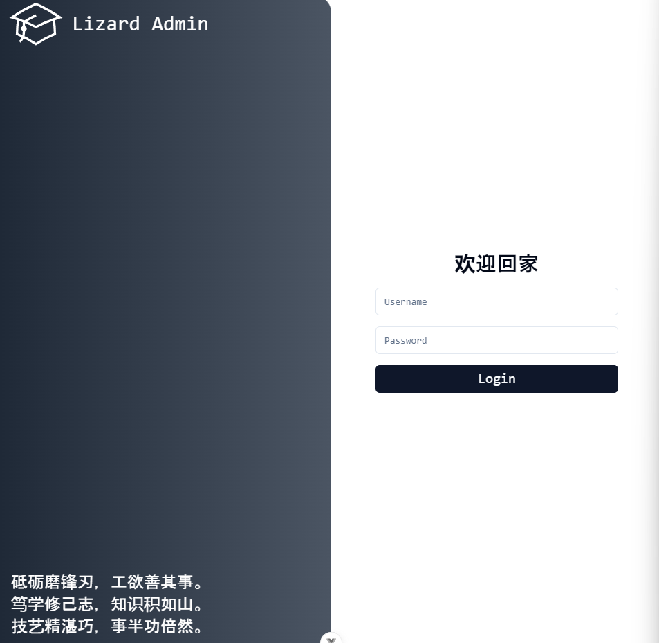

# lizard-vue-admin-template

基于vue3-ts-shadcn-tailwind-bun 的轻量级后台管理系统

设计文档参考: https://www.figma.com/design/rAe4GKDNlzjn9SNarJCJ8D/

### 技术栈
```
- vue3
- typescript
- shadcn
- naive-ui
- tailwind 
- apexcharts
- axios
- bun


npx shadcn-vue@latest add xxxxx
```

### 项目规范 新建一个view
- 名称/page.vue 为入口

### imgs
